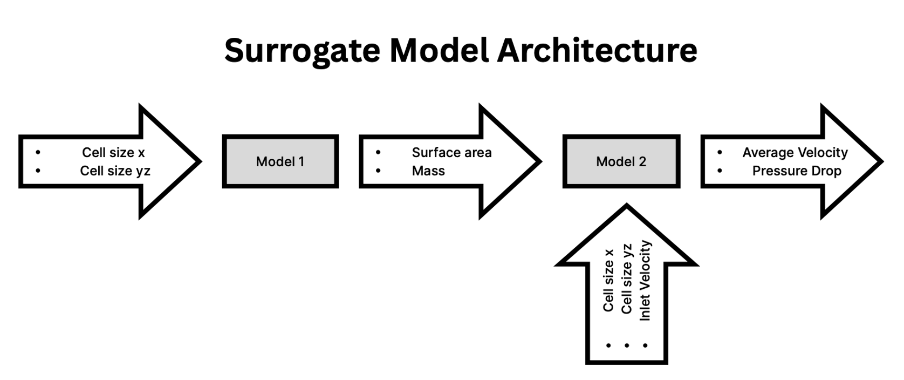

# nTop Hackathon 🍵

Design exploration and optimization using surrogate physics models (neural-network-based). This repo provides two surrogate models and a two-stage inverse-design optimizer that finds cell sizes and inlet velocities satisfying performance constraints.

---


<p align="center" width="90%">
    
</p>

## Quick links 🚀
- Notebook & code: [code.ipynb](code.ipynb)
- Dataset: [data.csv](data.csv)
- Python requirements: [requirements.txt](requirements.txt)
- Pretrained / optimized model artifacts: [optimized_models/trained_models.pkl](optimized_models/trained_models.pkl), [optimized_models/best_parameters.json](optimized_models/best_parameters.json)

---

## Core components 🧩
- Model wrappers (in [code.ipynb](code.ipynb)):
    - [`Model1Wrapper`](code.ipynb) — predicts Mass and Surface Area from X and YZ cell sizes.
    - [`Model2Wrapper`](code.ipynb) — predicts AvgVelocity and PressureDrop from cell sizes, inlet velocity, and Model1 outputs.
- Optimization (in [code.ipynb](code.ipynb)):
    - [`TwoStageOptimizer`](code.ipynb) — stage 1 maximizes surface area under a mass constraint; stage 2 sweeps inlet velocity to find feasible operating ranges.
    - [`run_two_stage_optimization`](code.ipynb), [`main_with_two_stage_optimization`](code.ipynb) — integration helpers to run the full pipeline.

---

## Quickstart ⚡

1. Create a clean environment and install requirements:
```sh
pip install -r requirements.txt
```
2. Open [code.ipynb](code.ipynb) in Jupyter or VS Code.  
    The notebook can be easily run for both model prediction and inverse design optimization by loading the best pretrained model automatically.

---

## Team IITD 👥

- [Rishabh Jain](https://github.com/Toni0704)
- [Shiv Ratn](https://github.com/ShivRatn)

---


